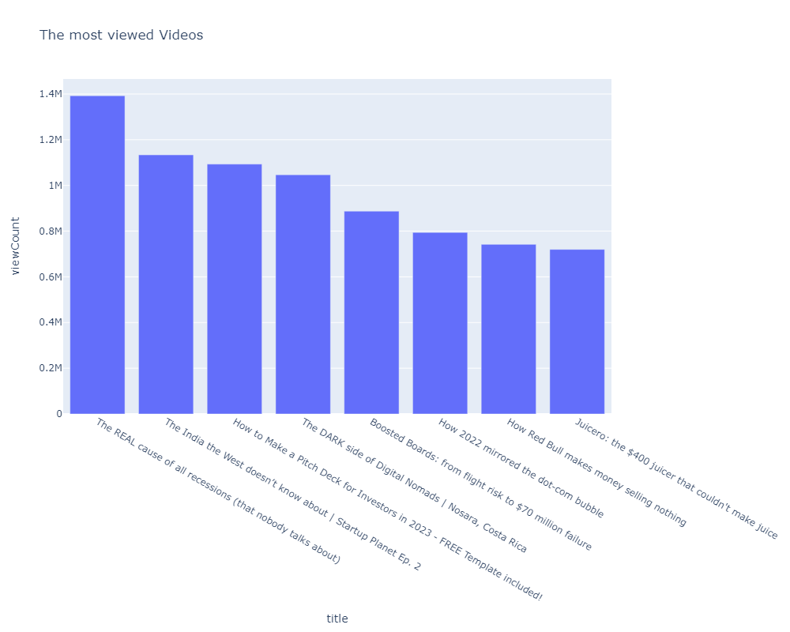

# Youtube-Api-Channel-Analysis

## Introduction  
This is a project that makes use of Python Programming Language to analyze a specific youtube channel and because I absolutely love Slidebean's Channel, I decided to analyse it. Slidebean's Channel talks about startups, businesses, pitch decks, startup stories, just mention it, once it concerns business and startups, you'll find it on their channel.
The project is to analyze and extract interesting information about their channel.
### NB: I do not have the dataset, I had to fetch it through interacting with Youtube's API and that was the fun of this project.

## Problem Statement
1.	What are the most viewed Videos on Slidebean's Channel?
2.	What are the least viewed Videos on Slidebean's Channel?
3.	What's the relationship between comments and likes on the page?
4.  What's the averge number of Views that Slidebean's channel gets?
5.	What does the distribution of the views and comments look like?
6.	Which days do people watch Slidebean's Videos the most?
7.	Generate Wordcloud, such that we can have an Idea of what the Channel stands for.

## Skills and Concept Demonstrated
1.	Python
2.	Numpy
3.	Pandas
4.	Plotly.Express
5.	Matplotlib
6.	Seaborn
7.	NLTK Library

## Feature Engineering
This involves deriving new values through the existing values and columns of the datasets. This helps to enhance the datasets and also to be able to get more solutions to pressing problems.
Because I was fetching the data directly from the website itself, I had to convert from different datatypes to types that would be suitable for the analysis I wanted to perform. The major feature engineering was based on the discrepancy between the datetime format that youtube uses and trge one python uses.

## Visualization
Each Problem Statement have been answered through using different Visualization methods that can be interpreted and understood even by the layman. The data comes alive through these Visuals.
1.	Which are the most viewed Videos on Slidebean's Channel?

